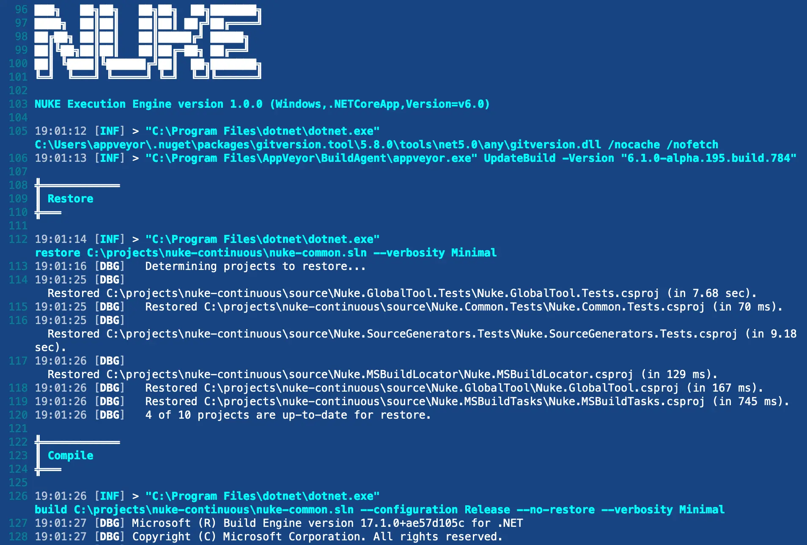
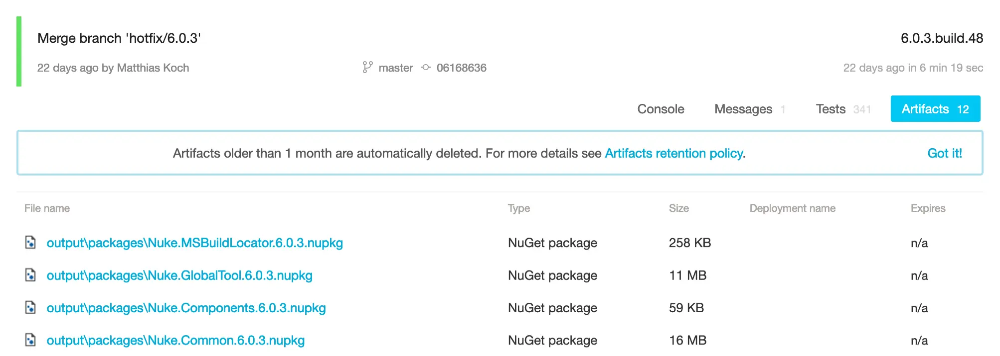

Running on [AppVeyor](https://www.appveyor.com/) will automatically enable custom theming for your build log output:



:::info
Please refer to the official [AppVeyor documentation](https://www.appveyor.com/docs/) for questions not covered here.
:::

## Environment Variables

You can access [predefined environment variables](https://www.appveyor.com/docs/environment-variables/) by using the `AppVeyor` class:

```csharp
AppVeyor AppVeyor => AppVeyor.Instance;

Target Print => _ => _
    .Executes(() =>
    {
        Log.Information("Branch = {Branch}", AppVeyor.RepositoryBranch);
        Log.Information("Commit = {Commit}", AppVeyor.RepositoryCommitSha);
    });
```

<details>
<summary>Exhaustive list of strongly-typed properties</summary>

```csharp
class AppVeyor
{
    string   AccountName                     { get; }
    string   ApiUrl                          { get; }
    string   BuildFolder                     { get; }
    int      BuildId                         { get; }
    int      BuildNumber                     { get; }
    string   BuildVersion                    { get; }
    string   BuildWorkerImage                { get; }
    Tool     Cli                             { get; }
    string   Configuration                   { get; }
    bool     ForcedBuild                     { get; }
    string   JobId                           { get; }
    string   JobName                         { get; }
    int      JobNumber                       { get; }
    string   Platform                        { get; }
    int      ProjectId                       { get; }
    string   ProjectName                     { get; }
    string   ProjectSlug                     { get; }
    int?     PullRequestNumber               { get; }
    string   PullRequestTitle                { get; }
    bool     Rebuild                         { get; }
    string   RepositoryBranch                { get; }
    string   RepositoryCommitAuthor          { get; }
    string   RepositoryCommitAuthorEmail     { get; }
    string   RepositoryCommitMessage         { get; }
    string   RepositoryCommitMessageExtended { get; }
    string   RepositoryCommitSha             { get; }
    DateTime RepositoryCommitTimestamp       { get; }
    string   RepositoryName                  { get; }
    string   RepositoryProvider              { get; }
    string   RepositoryScm                   { get; }
    bool     RepositoryTag                   { get; }
    string   RepositoryTagName               { get; }
    bool     ScheduledBuild                  { get; }
    string   Url                             { get; }
}
```

</details>

## Configuration Generation

You can generate [build pipeline files](https://appveyor.com/docs/appveyor-yml/) from your existing target definitions by adding the `AppVeyor` attribute. For instance, you can run the `Compile` target on every push with the latest Ubuntu image:

```csharp title="Build.cs"
[AppVeyor(
    AppVeyorImage.VisualStudio2022,
    InvokedTargets = new[] { nameof(Compile) })]
class Build : NukeBuild { /* ... */ }
``` 

<details>
<summary>Generated output</summary>

```yaml title="appveyor.yml"

image:
  - Visual Studio 2022

build_script:
  - cmd: .\build.cmd Compile
  - sh: ./build.cmd Compile
```

</details>

:::info
Whenever you make changes to the attribute, you have to [run the build](../01-getting-started/03-execution.md) at least once to regenerate the pipelines file.
:::

## Artifacts

If your targets produce artifacts, like packages or coverage reports, you can publish those directly from the target definition:

```csharp
Target Pack => _ => _
    .Produces(PackagesDirectory / "*.nupkg")
    .Executes(() => { /* Implementation */ });
```

<details>
<summary>Generated output</summary>

```yaml title="appveyor.yml"
artifacts:
  - path: output/packages/*.nupkg
```
</details>

After your build has finished, those artifacts will be listed under the artifacts tab:

<p style={{maxWidth:'900px'}}>



</p>
