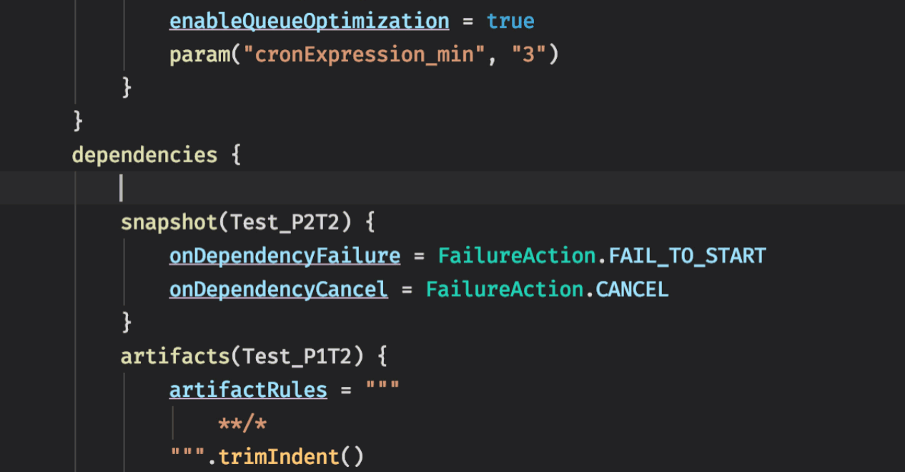
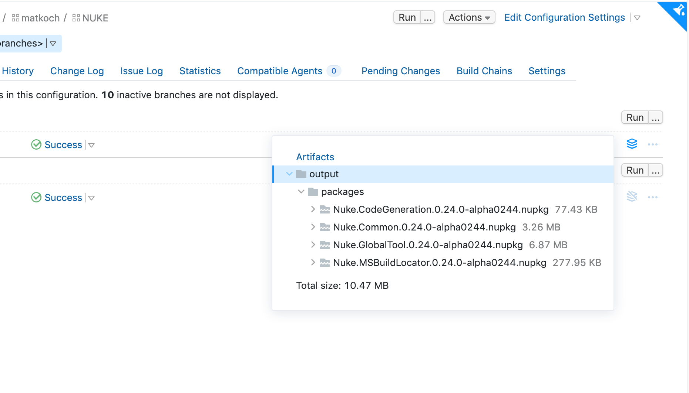
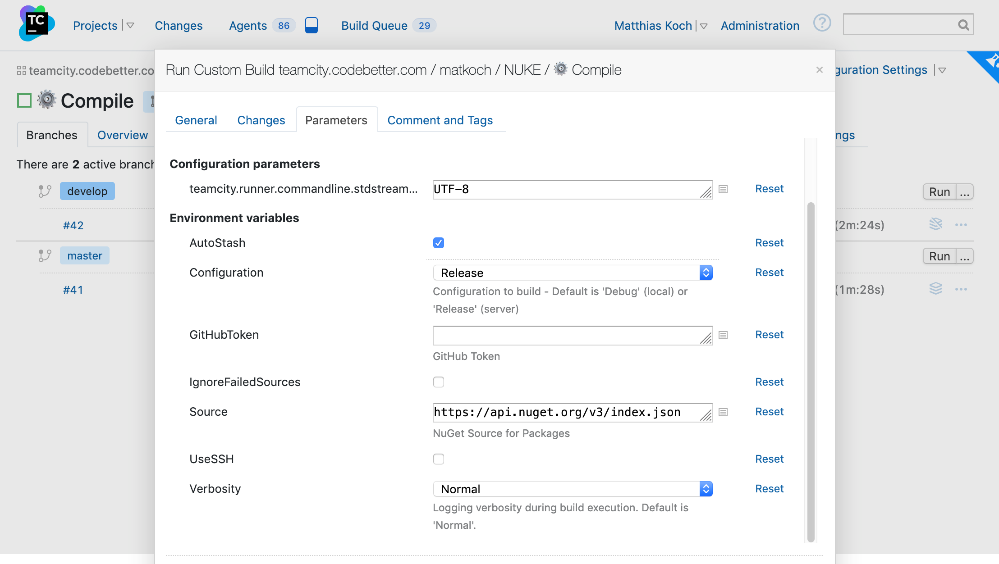

import { TwitterEmbedded } from "../../src/components/TwitterEmbedded";

If you dive into the DevOps world, chances are high you **meet YAML around the next corner**. For some tools, like Docker and Kubernetes, I think it's a good match. However, for CI/CD infrastructure it often becomes a nightmare, and actually, I'm not alone having such feelings. Recently, a tweet of Jeff Fritz started a debate about [YAML in DevOps](https://twitter.com/csharpfritz/status/1207431413341081601), to which the general agreement can be summarized as:

<TwitterEmbedded>
<p lang="en" dir="ltr">Welcome the world of YAML pain</p>&mdash; Claire Novotny (@clairernovotny) <a href="https://twitter.com/clairernovotny/status/1207433967097520129?ref_src=twsrc%5Etfw">December 18, 2019</a>
</TwitterEmbedded>

<!-- truncate -->

Many developers use YAML reluctantly. Personally, I would even say that the idea of _Configuration as Code_ is a lie, because it doesn't feel like coding (more about this in the next section). Yet, almost every CI/CD system under the sun is YAML-first. [Azure Pipelines](https://docs.microsoft.com/en-us/azure/devops/pipelines), [Bitrise](https://devcenter.bitrise.io/), [TravisCI](https://docs.travis-ci.com/), [GitHub Actions](https://help.github.com/en/actions), [AppVeyor](https://www.appveyor.com/docs/) – you name it. Some vendors stay clear from YAML, but their solutions are similarly limited.

By the way, Azure Pipelines actually provides some [better tooling around editing YAML](https://twitter.com/AzureDevOps/status/1117869418514489346), but apparently, it doesn't help much:

<TwitterEmbedded>
<p lang="en" dir="ltr">YAML CAN KISS MY &amp;SS <a href="https://t.co/YHe7bdBSsb">pic.twitter.com/YHe7bdBSsb</a></p>&mdash; Scott Hanselman (@shanselman) <a href="https://twitter.com/shanselman/status/1237145762229673984?ref_src=twsrc%5Etfw">March 9, 2020</a>
</TwitterEmbedded>

Alright, let's try getting more to the bottom of this!

## What's wrong with YAML

While I see how YAML configuration can be attractive, I truly believe that for CI/CD purpose, this is only because the sample pipelines in talks and blog posts are often just that – samples. [YAML sparked some resistance](https://noyaml.com/) for several reasons. Some of the most important ones, in particular for CI/CD, are:

- **It imposes long feedback loops.** Typically, the only way to test your configuration, is to commit your changes to the repository. Then the CI/CD system needs to pick up changes, and finally you might need to wait until the agent is available to trigger a new build. This adds up to a lot of time, especially given the following pitfalls.
- **It's error-prone.** We might indent too much or too little, mistype a well-known property, or forget to escape properly without even knowing. YAML is almost always valid, and there is no proper syntax highlighting. There are schema files that enable rudimentary code completion, but as a C# developer, this still feels clunky.
- **It's not refactoring-safe.** This is a matter of tooling again. Whenever we're dealing with IDs and their references, the best choice you have is _Search & Replace_. This should only be the last resort.
- **It's declarative. Not imperative.** There's a time and a place when you need to iterate over a collection, filter items, write some more complex conditions, and other funky stuff. YAML is just the wrong format for that.
- **It causes vendor lock-ins.** Each CI/CD system has its very own format. Switching to a different CI/CD system becomes non-trivial, as we have to rewrite the complete configuration.

One more important fact is that many YAML configurations define **inline Bash or PowerShell scripts**. Typically, those make it hard to use any kind of IDE tooling. However, in JetBrains IDEs we can use [language injections](https://www.jetbrains.com/help/idea/using-language-injections.html):

<TwitterEmbedded>
<p lang="en" dir="ltr">So I&#39;ve recently been working on some <a href="https://twitter.com/github?ref_src=twsrc%5Etfw">@GitHub</a> Actions with steps written in shell.<br/><br/>The bad thing is that I was doing that in YAML, so the syntax highlighting... oh, wait a sec... &#128526; <a href="https://twitter.com/intellijidea?ref_src=twsrc%5Etfw">@intellijidea</a> <a href="https://twitter.com/hashtag/github?src=hash&amp;ref_src=twsrc%5Etfw">#github</a> <a href="https://twitter.com/hashtag/intellij?src=hash&amp;ref_src=twsrc%5Etfw">#intellij</a> <a href="https://t.co/U6FiuwuAjS">pic.twitter.com/U6FiuwuAjS</a></p>&mdash; Jakub Chrzanowski (@hszanowski) <a href="https://twitter.com/hszanowski/status/1273324833842122753?ref_src=twsrc%5Etfw">June 17, 2020</a>
</TwitterEmbedded>

Seems like JetBrains at least partially fixed YAML! 🤓

## Modern Configuration as Code

Hilarious. Calling it _modern_ almost sounds like a second attempt to make it actually attractive. Following the same [discussion](https://twitter.com/csharpfritz/status/1207431413341081601) from earlier, Jeff Fritz is on to something:

<TwitterEmbedded>
<p lang="en" dir="ltr">I would rather have a scripting language over this and generate the YAML in the appropriate dialect.<br/><br/>Extra space? Whoops, your build didn&#39;t execute properly.</p>&mdash; Jeff Fritz (@csharpfritz) <a href="https://twitter.com/csharpfritz/status/1207434317179305986?ref_src=twsrc%5Etfw">December 18, 2019</a>
</TwitterEmbedded>

In fact, [TeamCity](https://www.jetbrains.com/teamcity) implements this approach [since 2016](https://blog.jetbrains.com/teamcity/2016/11/kotlin-configuration-scripts-an-introduction/) already. We can use the [Kotlin DSL](https://www.jetbrains.com/help/teamcity/kotlin-dsl.html) to implement our complete build pipeline, which is then internally converted by TeamCity to its own runner format, which is XML. I’m absolutely not a Java or Kotlin developer, but writing CI/CD scripts in Kotlin is actually pretty decent and discoverable when using [IntelliJ IDEA](https://www.jetbrains.com/idea/). We get all the IDE features like syntax highlighting, code completion, navigation, and refactorings:

<p style={{maxWidth:'600px'}}>



</p>

In my opinion, this is much better than YAML. We don’t have to commit our configuration just to realize that we missed an indentation, or mistyped a reference. Our IDE will just tell us right away, if something is semantically broken or we're good. As a bonus, whenever we feel lost in the Kotlin DSL, we can fallback to using the UI wizards and let TeamCity show us the particular configuration as Kotlin code:

<p style={{maxWidth:'500px'}}>


</p>

## Getting into Build Systems

If you’re a .NET developer, I can understand if you're feeling reluctant to use Kotlin DSL. After all, I’m a huge fan of the philosophy to use the same language for build implementation as for the rest of the project[^1]. Following this philosophy, and using build systems such as [FAKE](https://fake.build/), [CAKE](https://cakebuild.net/), or [BullsEye](https://github.com/adamralph/bullseye), ...

[^1]: Credits to [Gary Ewan Park](https://twitter.com/gep13)

<TwitterEmbedded>
<p lang="en" dir="ltr">The the YAML is essentially: run build.cake</p>&mdash; Claire Novotny (@clairernovotny) <a href="https://twitter.com/clairernovotny/status/1207435056316375042?ref_src=twsrc%5Etfw">December 18, 2019</a>
</TwitterEmbedded>

Great thing, right? We gain the **benefit of being decoupled** from the CI/CD system, so we don't experience a vendor lock-in, and can easily switch if we need to. Another plus, is that we can always **execute the build locally**, which makes troubleshooting much more _fun_. However, this approach also comes with a drawback: **we deliberately avoid using features of the CI/CD system** like parallelization of tasks or build queue optimization. We basically trade in portability and ease of use at the cost of provided value of the CI/CD system.

## Merging Approaches

Can there be a way to get the **best of both worlds** without any of the disadvantages? I say yes! What it boils down to is what Damian Hickey suggested:

<TwitterEmbedded>
<p lang="en" dir="ltr">Going to see if I can run individual bullseye defined targets-as-steps. Will share how I get on.</p>&mdash; Damian Hickey (@randompunter) <a href="https://twitter.com/randompunter/status/1168551652221235205?ref_src=twsrc%5Etfw">September 2, 2019</a> 
</TwitterEmbedded>

Meaning that we use both, a CI/CD configuration and a build system, whereas the **CI/CD configuration defines multiple steps, each invoking the build system with a separate target**. Typically, we get much better log output this way, and also allow the CI/CD system to gather statistical data. However, even if the CI/CD configuration is quite simple, writing it ourselves **is tedious and has potential to break things**. For instance, when a target or input parameter name gets changed, we need to update configuration. Another issue is that it's **hard to share state** between different targets invocations. For instance, one target might calculate an in-memory list, which should be reported in the next target. How would that work?

## Integration with NUKE

NUKE is similar to CAKE and FAKE. One unique aspect to NUKE is that it **generates the CI/CD configuration** from the C# build implementation itself. Currently supporting [Azure Pipelines](https://github.com/nuke-build/nuke/blob/develop/azure-pipelines.yml), [AppVeyor](https://github.com/nuke-build/nuke/blob/develop/appveyor.yml), [GitHub Actions](https://github.com/nuke-build/nuke/blob/develop/.github/workflows/continuous.yml), [TeamCity](https://github.com/nuke-build/nuke/blob/develop/.teamcity/settings.kts), [GitLab](https://github.com/nuke-build/nuke/blob/develop/.gitlab-ci.yml), and [JetBrains Space](https://github.com/nuke-build/nuke/blob/develop/.space.kts). Let's start with a more simple example and see how we can use GitHub Actions for our CI build:

```csharp title="Build.cs" showLineNumbers
[GitHubActions(
    "continuous",
    GitHubActionsImage.UbuntuLatest,
    GitHubActionsImage.MacOsLatest,
    On = new[] { GitHubActionsTrigger.Push },
    InvokedTargets = new[] { nameof(Test), nameof(Pack) },
    ImportSecrets = new[] { nameof(SlackWebhook), nameof(GitterAuthToken) })]
partial class Build : NukeBuild
{
    public static int Main() => Execute<Build>(x => x.Pack);

    [Parameter("Gitter Auth Token")] readonly string GitterAuthToken;
    [Parameter("Slack Webhook")] readonly string SlackWebhook;

    Target Test => _ => _
        .Executes(() =>
        {
        });

    Target Pack => _ => _
        .Executes(() =>
        {
        });
}
```

In the example above, we're adding the `GitHubActions` attribute to our build class (Line 1) to define a new workflow called `continuous`. The workflow invokes the `Test` and `Pack` targets (Line 6) on 2 different images (Line 3-4) whenever we push new changes (Line 5). Additionally, we import the secrets `GitterAuthToken` and `SlackWebhook` (Line 7). Note that everything is **refactoring-safe**! Images and triggers are defined via enumerations. The targets and parameters are referenced with the `nameof` operator. If we rename them, our YAML configuration will change as well. Finally, here's the **generated YAML file** based on our attribute:

```yaml title=".github/workflows/continuous.yml" showLineNumbers
// <auto-generated />

name: continuous

on: [push]

jobs:
  ubuntu-latest:
    name: ubuntu-latest
    runs-on: ubuntu-latest
    steps:
      - uses: actions/checkout@v1
      - name: Run './build.cmd Test Pack'
        run: ./build.cmd Test Pack
        env:
            SlackWebhook: ${{ secrets.SlackWebhook }}
            GitterAuthToken: ${{ secrets.GitterAuthToken }}
  macOS-latest:
    name: macOS-latest
    runs-on: macOS-latest
    steps:
      - uses: actions/checkout@v1
      - name: Run './build.cmd Test Pack'
        run: ./build.cmd Test Pack
        env:
            SlackWebhook: ${{ secrets.SlackWebhook }}
            GitterAuthToken: ${{ secrets.GitterAuthToken }}
```

A more complex example is the following usage of the `TeamCity` attribute that generates a configuration for TeamCity:

```csharp title="Build.cs" showLineNumbers
[TeamCity(
    TeamCityAgentPlatform.Windows,
    VcsTriggeredTargets = new[] { nameof(Pack), nameof(Test) },
    NightlyTriggeredTargets = new[] { nameof(Test) },
    ManuallyTriggeredTargets = new[] { nameof(Publish) })]
partial class Build : NukeBuild
{
    AbsolutePath TestResultDirectory => OutputDirectory / "test-results";

    [Partition(2)] readonly Partition TestPartition;
    IEnumerable<Project> TestProjects => TestPartition.GetCurrent(Solution.GetProjects("*.Tests"));

    Target Test => _ => _
        .DependsOn(Compile)
        .Produces(TestResultDirectory / "*.trx")
        .Produces(TestResultDirectory / "*.xml")
        .Partition(() => TestPartition)
        .Executes(() =>
        {
           // Test invocation
        });
}
```

This time we won't look at the generated code, but point out individual features:

- **Nightly builds** are defined via `NightlyTriggeredTargets` property (Line 4). Again, we can reference the `Test` target with the `nameof` operator. Internally, NUKE will generate a [scheduled trigger](https://www.jetbrains.com/help/teamcity/configuring-schedule-triggers.html).
- **Manual builds** are defined via `ManuallyTriggeredTargets` (Line 5). In this case, we choose that the `Publish` target is represented as a [deployment build configuration](https://www.jetbrains.com/help/teamcity/deployment-build-configuration.html).
- **Parallelization** can be achieved in three easy steps. Firstly, we declare a `TestPartition` object along with its size (Line 10). Secondly, we assign the partition to the `Test` target by calling `Partition(() => TestPartition)` (Line 17). This causes TeamCity to use a [composite build configuration](https://www.jetbrains.com/help/teamcity/composite-build-configuration.html) with multiple sub-configurations according to the partition size. In the last step, we use the partition to get the current slice of test projects for the currently running sub-configuration (Line 11).
- **[Publishing and consuming artifacts](https://www.jetbrains.com/help/teamcity/build-artifact.html)** is just a matter of calling `Produces(...)` and `Consumes(...)` (Line 15-16). This can be used to forward data to a subsequent target, or to provide file downloads through the TeamCity UI.
- **[Build queue optimization](https://www.jetbrains.com/help/teamcity/build-queue.html)** is more of an implicit feature in TeamCity that comes along with the separation of different targets. Whenever a target has already been executed and could be reused, for instance when the affecting files haven't changed, TeamCity will happily do that and save you resources.

Here are a few illustrations how things will look like in TeamCity. Including the _Run Build_ dialog, that automatically exposes [all parameters declared](http://www.nuke.build/docs/authoring-builds/parameter-declaration.html) in the build class:

Here is an illustration how the build configurations will look like in TeamCity:


Another one with the build artifacts, which are automatically published:



And a last one showing how defined parameters will surface in the _Run Custom Build_ dialog:



If you want to learn more about NUKE and its CI/CD integration, check out the [documentation](http://www.nuke.build/docs/authoring-builds/ci-integration.html).

One remaining issue is to **allow different build steps to share state** on a .NET process level. For instance, changes to a field of type `List<Data>` should be available in the next build step. A possible solution is to deserialize and serialize the build object before and after a build is invoked. TeamCity actually provides a great extension point with the `.teamcity` directory, which is automatically published as hidden artifact. Other CI/CD systems have not been evaluated for this functionality yet.

## Conclusion

As far as I'm concerned, extending build systems to generate CI/CD configuration files is an interesting way to provide a better developer experience when building in different environments. Publishing artifacts, nightly builds, parallelization, build queue optimizations, and other gems are just ~~a step~~ an attribute away. We don't need to know about CI/CD systems inside out, and there is much less effort involved when you switch between them.

**Skip the YAML pain and try NUKE!**

<!--
- https://twitter.com/totollygeek/status/1210633275938607104
- https://twitter.com/vizaster/status/1179692600883924992
- https://twitter.com/icaromedeiros/status/1207602746041536513
- [legacy test code](https://github.com/microsoft/azure-pipelines-tasks/blob/746443be5cee275e65f33d5a9fdeefc183632d65/Tests-Legacy/L0/PublishCodeCoverageResults/_suite.ts#L193)
-->
