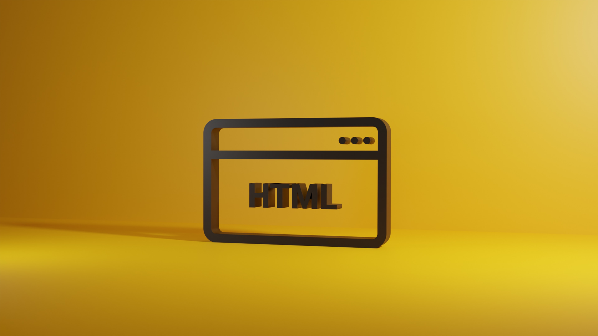

About 8 months ago, we started working on our new website. It goes without saying that this was a long-time overdue! How could you get the most out of all the cool features, if they aren't properly documented? 🤔 Today, I'm very excited to finally raise the curtains and show you the results.

<!-- truncate -->

## Technical Highlights

The switch to our new static-site generator brings lots of cool new features:

- **🗞 Blog** – Stay informed about the latest and greatest!
- **📚 Articles** – Comprehensive content around general build automation.
- **🔍 Search** – Use `Cmd+K` or `/` to open the search bar and start typing!
- **🌙 Dark Mode** – Probably the only thing developers really care about?!
- **🧰 Code Snippets** – Beautiful highlighting, soft wrapping, and a copy button.
- **📢 Announcements** – Immediately see what's new on the top of the page!
- **📲 PWA** – Install this website as a desktop or mobile app!
- **🌐 i18n (help us!)** – Get in touch if you can help with translations!

## Credits

Building this new experience is all about standing on the shoulders of giants! Meet some fantastic projects, tools, and services we use:

- 🦖 **[Docusaurus](https://docusaurus.io)** – This static-site generator based on React has been nothing but pure joy to work with! Excluding the usual suspects like index page and footer, we could always focus on writing the content!
- 🖼 **[unDraw](https://undraw.co/)** – Our new go-to website for beautiful open-source illustrations that help to emphasize great features. They don't require attributions, but we do it anyway!
- 🎬 **[Animista](https://animista.net/)** – It provides a great collection of ready-to-use CSS animation that really let your logos and images stand out. Just copy, paste, and be amazed! If you haven't seen our main page yet, you should [check it out](/) right now!
- 📝 **[MarkdownSnippets](https://github.com/SimonCropp/MarkdownSnippets)** – A .NET tool that helps us keeping code snippets up-to-date and working. Simon Cropp has once again created something really useful and practical.
- 🖋 **[JetBrains Mono](https://www.jetbrains.com/lp/mono/)** – An absolutely beautiful open-source font with OpenType features and ligatures. Makes our code snippets even better!
- 📐 **[Mermaid](https://mermaid-js.github.io/)** – An amazing, easy-to-use graph visualization library. It's a great tool to visualize our features and allow better understanding.
- 🗺 **[Algolia](https://www.algolia.com/)** – This helps us with indexing and hosting of search data to make our website more accessible.
- 🎞 **[Asciinema](https://asciinema.org/)** – A great way to record terminal sessions and provide better illustrations for command-line tools.

Personal thanks goes out to Ulrich Buchgraber, Rodney Littles II, Matt Richardson, Olga Nelioubov, Maarten Balliauw, Ron Myers, Todor Todorov, Georg Dangl, Will Smith, Dylan Perks, Michael Staib, Dennis Doomen, and Johannes Ebner. Without your support, NUKE might not be what it is today! 💙💙💙

**Goodbye and have fun browsing the website!** 😃

**PS: If you can spot one of the Easter eggs, ping me on [Slack](https://communityinviter.com/apps/nukebuildnet/nuke) or [Discord](https://discord.gg/6AbK88ysuw) to get a nice surprise!** 🐰
