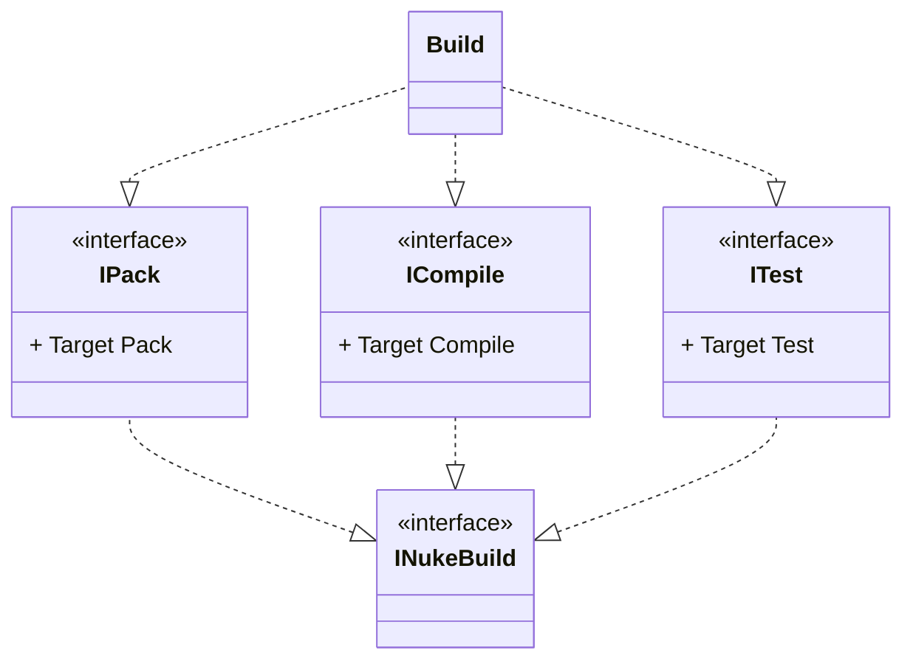
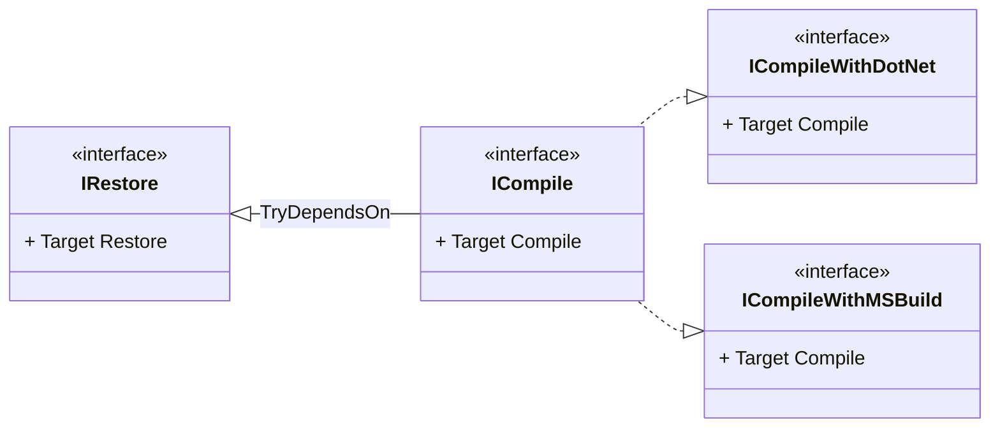

import Tabs from '@theme/Tabs';
import TabItem from '@theme/TabItem';

With build components you can implement your build infrastructure once, and compose individual builds across different repositories. Central to the idea of build components are [interface default implementations](https://devblogs.microsoft.com/dotnet/default-implementations-in-interfaces/), which allow you separating targets by their concerns following the [single-responsibility principle](https://en.wikipedia.org/wiki/Single-responsibility_principle), and pulling them into your build just by inheriting the interface. A typical build based on components could look like this:



The component stubs from above can be translated into code as follows, whereas the `INukeBuild` base interface allows the components to use [build base properties](../02-fundamentals/04-builds.md#base-properties):

```csharp
interface ICompile : INukeBuild
{
    Target Compile => _ => _
        .Executes(() => { /* Implementation */ });
}

interface IPack : INukeBuild
{
    Target Pack => _ => _
        .Executes(() => { /* Implementation */ });
}

interface ITest : INukeBuild
{
    Target Test => _ => _
        .Executes(() => { /* Implementation */ });
}
```

In the actual `Build` class, all you have to do is to inherit the components:

```csharp
class Build : NukeBuild, ICompile, IPack, ITest
{
    // Targets are inherited
}
```

## Parameters

In build components, you can use [parameters](../02-fundamentals/06-parameters.md) and other auto-injection attributes, like [`GitRepositoryAttribute`](../03-common/05-repository.md) or [`SolutionAttribute`](../03-common/07-solution-project-model.md), similar as in regular build classes. Though, since interfaces can't define instance fields or properties, the `INukeBuild` base interface provides a helper method that caches and returns resolved values for you:

```csharp
interface IComponent : INukeBuild
{
    [Parameter]
    string Parameter => TryGetValue(() => Parameter);

    [Solution]
    string Solution => TryGetValue(() => Solution);
}
```

:::tip
The `TryGetValue` method can return `null`, for instance, when a parameter is not available. If you want to provide a default value, you can use the [null-coalescing operator](https://docs.microsoft.com/en-us/dotnet/csharp/language-reference/operators/null-coalescing-operator):

```csharp
interface IComponent : INukeBuild
{
    [Parameter]
    string Parameter => TryGetValue(() => Parameter) ?? "default";
}
```

Note that the fallback value is created on every property access, so you might want to cache it in a static field. 
:::

### Parameter Prefixes

For better distinction of similarly named component parameters and to avoid [smurf naming](https://blog.codinghorror.com/new-programming-jargon/#21) techniques, you can use the `ParameterPrefixAttribute` to introduce a common prefix for all parameters in a component:

```csharp
[ParameterPrefix(nameof(IComponent1))]
interface IComponent1 : INukeBuild
{
    // Resolved as IComponent1Value
    [Parameter] string Value => TryGetValue(() => Value);
}

[ParameterPrefix(nameof(IComponent2))]
interface IComponent2 : INukeBuild
{
    // Resolved as IComponent2Value
    [Parameter] string Value => TryGetValue(() => Value);
}
```

## Dependencies

You can define [dependencies](../02-fundamentals/05-targets.md#dependencies) between targets similar as in regular build classes. Since targets from components cannot easily be referenced from their inheritors[^1], you must pass the component type as a generic parameter and provide the target through a lambda expression:

```csharp
class Build : NukeBuild, IComponent
{
    Target MyTarget => _ => _
        .DependsOn<IComponent>(x => x.Target)
        .Executes(() =>
        {
        });
}
```

:::tip
When a build component only defines a single target, you can use the shorthand syntax and omit the lambda that specifies the target. For instance, the above example can become:


```csharp
class Build : NukeBuild, IComponent
{
    Target MyTarget => _ => _
        .DependsOn<IComponent>()
        .Executes(() =>
        {
        });
}
```
:::

### Loose Dependencies

Apart from [regular dependencies](../02-fundamentals/05-targets.md#dependencies), you can also define loose dependencies that only get applied when the respective component is also inherited. This allows you to compose your build more flexibly without imposing a particular inheritance chain:

<Tabs>
  <TabItem value="execution" label="Execution Dependencies">

```csharp title="Build.cs"
interface IComponent1 : INukeBuild
{
    Target A => _ => _
        // highlight-start
        .TryDependentFor<IComponent2>()      // Choose this...
        // highlight-end
        .Executes(() => { });
}

interface IComponent2 : INukeBuild
{
    Target B => _ => _
        // highlight-start
        .TryDependsOn<IComponent1>()         // ...or this!
        // highlight-end
        .Executes(() => { });
}
```

  </TabItem>
  <TabItem value="ordering" label="Ordering Dependencies">

```csharp title="Build.cs"
interface IComponent1 : INukeBuild
{
    Target A => _ => _
        // highlight-start
        .TryBefore<IComponent2>()            // Choose this...
        // highlight-end
        .Executes(() => { });
}

interface IComponent2 : INukeBuild
{
    Target B => _ => _
        // highlight-start
        .TryAfter<IComponent1>()             // ...or this!
        // highlight-end
        .Executes(() => { });
}
```

  </TabItem>
  <TabItem value="triggers" label="Trigger Dependencies">

```csharp title="Build.cs"
interface IComponent1 : INukeBuild
{
    Target A => _ => _
        // highlight-start
        .TryTriggers<IComponent2>()          // Choose this...
        // highlight-end
        .Executes(() => { });
}

interface IComponent2 : INukeBuild
{
    Target B => _ => _
        // highlight-start
        .TryTriggeredBy<IComponent1>()       // ...or this!
        // highlight-end
        .Executes(() => { });
}
```

  </TabItem>
</Tabs>

## Extensions and Overrides

Another SOLID design principle that can be applied to build components is the [open-closed principle](https://en.wikipedia.org/wiki/Open%E2%80%93closed_principle). Once you have pulled a target into your build, it can be extended or overridden using [explicit interface implementations](https://docs.microsoft.com/en-us/dotnet/csharp/programming-guide/interfaces/explicit-interface-implementation):

<Tabs groupId="extensions-overrides">
  <TabItem value="extensions" label="Extending Targets" default>

```csharp
class Build : NukeBuild, IComponent
{
    Target IComponent.Target => _ => _
        .Inherit<IComponent>()
        .Executes(() => { });
}
```

  </TabItem>
  <TabItem value="overrides" label="Overriding Targets">

```csharp
class Build : NukeBuild, IComponent
{
    Target IComponent.Target => _ => _
        .Executes(() => { });
}
```

  </TabItem>
</Tabs>

:::tip
With build components you can push the separation of concerns as far as you wish. For instance, consider the following example where a common `ICompile` component only defines the dependency to the `IRestore` component. Another two derived types of `ICompile` provide the actual implementation of the target using the .NET CLI and MSBuild:



```csharp
interface IRestore : INukeBuild
{
    Target Restore => _ => _
        .Executes(() => { /* Implementation */ });
}

interface ICompile : INukeBuild
{
    Target Compile => _ => _
        .TryDependsOn<IRestore>();
}

interface ICompileWithDotNet : ICompile
{
    Target ICompile.Compile => _ => _
        .Inherit<ICompile>()
        .Executes(() => { /* .NET CLI implementation */ });
}

interface ICompileWithMSBuild : ICompile
{
    Target ICompile.Compile => _ => _
        .Inherit<ICompile>()
        .Executes(() => { /* MSBuild implementation */ });
}
```

Targets that follow later in the execution plan can now reference the implementation-agnostic definition:

```csharp
class Build : NukeBuild, ICompileWithDotNet
{
    Target Pack => _ => _
        .DependsOn<ICompile>()
        .Executes(() => { /* Implementation */ });
}
```
:::

[^1]: Interface default members behave like explicit interface implementations, which means that to access their members, the `this` reference must be cast explicitly to the interface type. For instance, `((IComponent)this).Target`.
