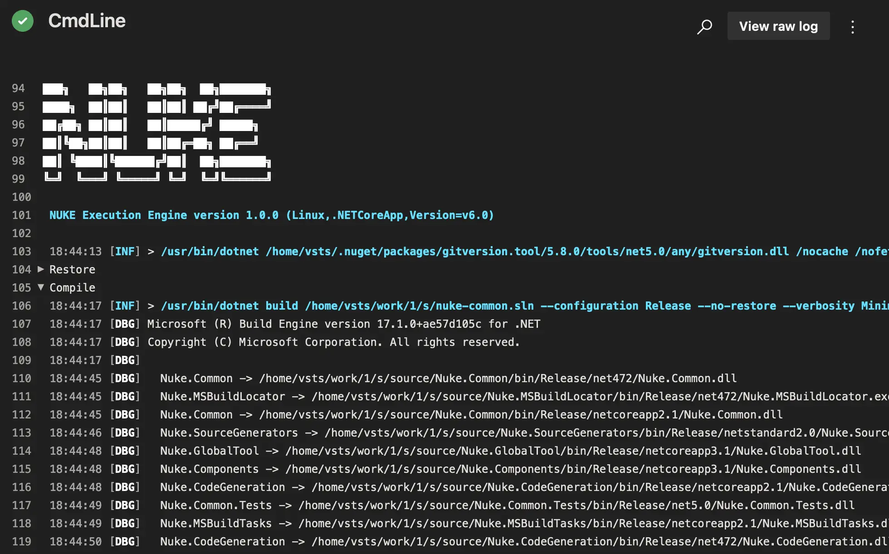

Running on [Azure Pipelines](https://azure.microsoft.com/en-us/services/devops/pipelines/) will automatically enable custom theming for your build log output including [collapsible sections](https://docs.microsoft.com/en-us/azure/devops/pipelines/scripts/logging-commands#formatting-commands) for better structuring:



:::info
Please refer to the official [Azure Pipelines documentation](https://docs.microsoft.com/en-us/azure/devops/pipelines/?view=azure-devops) for questions not covered here.
:::

## Environment Variables

You can access [predefined environment variables](https://docs.microsoft.com/en-us/azure/devops/pipelines/build/variables) by using the `AzurePipelines` class:

```csharp
AzurePipelines AzurePipelines => AzurePipelines.Instance;

Target Print => _ => _
    .Executes(() =>
    {
        Log.Information("Branch = {Branch}", AzurePipelines.SourceBranch);
        Log.Information("Commit = {Commit}", AzurePipelines.SourceVersion);
    });
```

<details>
<summary>Exhaustive list of strongly-typed properties</summary>

```csharp
class AzurePipelines
{
    string                       AccessToken                    { get; }
    string                       AgentBuildDirectory            { get; }
    string                       AgentHomeDirectory             { get; }
    long                         AgentId                        { get; }
    AzurePipelinesJobStatus      AgentJobStatus                 { get; }
    string                       AgentMachineName               { get; }
    string                       AgentName                      { get; }
    string                       AgentWorkFolder                { get; }
    string                       ArtifactStagingDirectory       { get; }
    string                       BinariesDirectory              { get; }
    long                         BuildId                        { get; }
    string                       BuildNumber                    { get; }
    AzurePipelinesBuildReason    BuildReason                    { get; }
    string                       BuildUri                       { get; }
    Guid                         CollectionId                   { get; }
    string                       DefaultWorkingDirectory        { get; }
    long                         DefinitionId                   { get; }
    string                       DefinitionName                 { get; }
    long                         DefinitionVersion              { get; }
    string                       JobDisplayName                 { get; }
    Guid                         JobId                          { get; }
    string                       PhaseName                      { get; }
    long?                        PullRequestId                  { get; }
    string                       PullRequestSourceBranch        { get; }
    string                       PullRequestTargetBranch        { get; }
    string                       QueuedBy                       { get; }
    Guid                         QueuedById                     { get; }
    bool                         RepositoryClean                { get; }
    bool                         RepositoryGitSubmoduleCheckout { get; }
    string                       RepositoryLocalPath            { get; }
    string                       RepositoryName                 { get; }
    AzurePipelinesRepositoryType RepositoryProvider             { get; }
    string                       RepositoryTfvcWorkspace        { get; }
    string                       RepositoryUri                  { get; }
    string                       RequestedFor                   { get; }
    string                       RequestedForEmail              { get; }
    Guid                         RequestedForId                 { get; }
    string                       SourceBranch                   { get; }
    string                       SourceBranchName               { get; }
    string                       SourceDirectory                { get; }
    string                       SourceTfvcShelveset            { get; }
    string                       SourceVersion                  { get; }
    string                       StageDisplayName               { get; }
    string                       StageName                      { get; }
    string                       StagingDirectory               { get; }
    Guid                         TaskInstanceId                 { get; }
    string                       TeamFoundationCollectionUri    { get; }
    string                       TeamProject                    { get; }
    Guid                         TeamProjectId                  { get; }
    string                       TestResultsDirectory           { get; }
}
```

</details>

## Configuration Generation

You can generate [build pipeline files](https://docs.microsoft.com/en-us/azure/devops/pipelines/create-first-pipeline) from your existing target definitions by adding the `AzurePipelines` attribute. For instance, you can run the `Compile` target on every push with the latest Ubuntu image: 

```csharp title="Build.cs"
[AzurePipelines(
    AzurePipelinesImage.UbuntuLatest,
    InvokedTargets = new[] { nameof(Compile) })]
class Build : NukeBuild { /* ... */ }
``` 

<details>
<summary>Generated output</summary>

```yaml title="azure-pipelines.yml"
stages:
  - stage: ubuntu_latest
    displayName: 'ubuntu-latest'
    pool:
      vmImage: 'ubuntu-latest'
    jobs:
      - job: Compile
        displayName: 'Compile'
        steps:
          - task: CmdLine@2
            inputs:
              script: './build.cmd Compile --skip'
```

</details>

:::info
Whenever you make changes to the attribute, you have to [run the build](../01-getting-started/03-execution.md) at least once to regenerate the pipelines file.
:::

### Artifacts

If your targets produce artifacts, like packages or coverage reports, you can publish those directly from the target definition:

```csharp
Target Pack => _ => _
    .Produces(PackagesDirectory / "*.nupkg")
    .Executes(() => { /* Implementation */ });
```

<details>
<summary>Generated output</summary>

```yaml title="azure-pipelines.yml"
- task: PublishBuildArtifacts@1
  inputs:
    artifactName: packages
    pathtoPublish: 'output/packages'
```
</details>

After your build has finished, those artifacts will be listed under the artifacts tab:

<p style={{maxWidth:'900px'}}>


</p>

### Importing Secrets

If you want to use [secret variables](https://docs.microsoft.com/en-us/azure/devops/pipelines/process/variables#secret-variables) from your repository, you can use the `ImportSecrets` property to automatically load them into a [secret parameter](../02-fundamentals/06-parameters.md#secret-parameters) defined in your build:

```csharp title="Build.cs"
[AzurePipelines(
    // ...
    ImportSecrets = new[] { nameof(NuGetApiKey) })]
class Build : NukeBuild
{
    [Parameter] [Secret] readonly string NuGetApiKey;
}
```

<details>
<summary>Generated output</summary>

```yaml title="azure-pipelines.yml"
- task: CmdLine@2
  inputs:
    script: './build.cmd Publish --skip'
  env:
    NuGetApiKey: $(NuGetApiKey)
```

</details>

:::note
If you're facing any issues, make sure that the name in the Azure Pipelines settings is the same as generated into the pipelines file. 
:::

### Using Access Tokens

For every pipeline run, Azure Pipelines generates a [one-time token](https://docs.microsoft.com/en-us/azure/devops/pipelines/process/access-tokens) with [adequate permissions](https://docs.microsoft.com/en-us/azure/devops/pipelines/process/access-tokens#manage-build-service-account-permissions) that you can use to authenticate with the Azure Pipelines API. You can enable the access token in the attribute as follows:

```csharp title="Build.cs"
[AzurePipelines(
    // ...
    EnableAccessToken = true)]
class Build : NukeBuild
{
    AzurePipelines AzurePipelines => AzurePipelines.Instance;

    Target Request => _ => _
        .Executes(() =>
        {
            Log.Information("Access Token = {Token}", AzurePipelines.AccessToken);
        });
}
```

<details>
<summary>Generated output</summary>

```yaml title="azure-pipelines.yml"
- task: CmdLine@2
  inputs:
    script: './build.cmd Release --skip'
  env:
    SYSTEM_ACCESSTOKEN: $(System.AccessToken)

```

</details>

### Caching

By default, the generated pipeline file will include [caching tasks](https://docs.microsoft.com/en-us/azure/devops/pipelines/release/caching) to reduce the time for installing the .NET SDK (if not preinstalled) and restoring NuGet packages.

<details>
<summary>Generated output</summary>

```yaml title="azure-pipelines.yml"
- task: Cache@2
  displayName: Cache (nuke-temp)
  inputs:
    key: $(Agent.OS) | nuke-temp | **/global.json, **/*.csproj
    restoreKeys: $(Agent.OS) | nuke-temp
    path: .nuke/temp
- task: Cache@2
  displayName: Cache (nuget-packages)
  inputs:
    key: $(Agent.OS) | nuget-packages | **/global.json, **/*.csproj
    restoreKeys: $(Agent.OS) | nuget-packages
    path: $(HOME)/.nuget/packages
```

</details>

You can customize the caching tasks by overwriting the following properties:

```csharp title="Build.cs"
[AzurePipelines(
    // ...
    CacheKeyFiles = new[] { "**/global.json", "**/*.csproj" },
    CachePaths = new[]
    {
        AzurePipelinesCachePaths.Nuke,
        AzurePipelinesCachePaths.NuGet
    })]
class Build : NukeBuild { /* ... */ }
```
